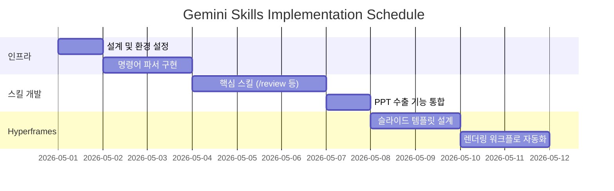

# Implementation Plan: Gemini Skills

## 1. 단계별 로드맵
### Phase 1: 기본 인프라 구축 [v]
- `gemini.md` 파일 구조 설계 [v]
- 슬래시 명령어 파싱 로직 구현 [v]

### Phase 2: 핵심 스킬 구현 [v]
- `/review`, `/test`, `/doc` 스킬 정의 및 테스트 [v]
- 프롬프트 엔지니어링을 통한 품질 최적화 [v]

### Phase 3: 시각화 및 자동화 [v]
- Mermaid 다이어그램 자동 생성 스킬 추가 [v]
- 코드 변경 사항 자동 감지 및 문서화 워크플로 구축 [v]
- Git 푸시 자동화 스킬 (/ship) 구현 [v]

## 2. 기술 스택
- **Language**: Markdown (Documentation), Python (Logic), HTML/CSS (Slides)
- **Tooling**: Gemini CLI, Mermaid.js, Hyperframes, PandasToPowerpoint
- **Environment**: Windows (win32), Node.js v22+, FFmpeg, Python 3.12+

## 3. 구현 일정 (Mermaid)

