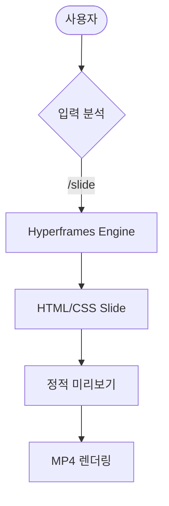

# PRD: Gemini Slash Command Skills System

## 1. 프로젝트 개요
Google Chrome의 'Skills' 기능을 벤치마킹하여, Gemini 에이전트에서 반복적인 프롬프트를 슬래시 명령어(/)로 실행할 수 있는 재사용 가능한 워크플로 시스템을 구축합니다.

## 2. 목표
- 프롬프트 입력 시간 단축 및 작업 효율성 증대
- 출력 결과의 일관성 및 품질 유지
- 복잡한 작업을 원클릭으로 자동화

## 3. 주요 기능
- **슬래시 명령어 매핑**: `/review`, `/test`, `/doc` 등의 단축 명령어를 고품질 프롬프트와 연결
- **컨텍스트 자동 삽입**: 현재 작업 중인 코드나 문서 내용을 프롬프트에 자동으로 결합
- **시각화 자동화**: 분석 결과를 Mermaid UML 다이어그램 및 Hyperframes 기반 동영상으로 즉시 변환
- **네이티브 PPT 수출**: PandasToPowerpoint를 활용하여 슬라이드 내용을 수정 가능한 파워포인트(PPTX) 형식으로 제공

## 4. 핵심 사용자 시나리오
1. 사용자가 코드 작성 후 `/review` 입력
2. 에이전트가 미리 정의된 '코드 리뷰 스킬' 프롬프트를 호출
3. 분석 결과를 바탕으로 `/slide`를 호출하여 리뷰 요약 영상 생성
4. `/ppt` 명령을 통해 오프라인 보고용 파워포인트 파일 생성
5. `/render`를 통해 최종 MP4 파일 획득

## 5. 시스템 아키텍처 (Mermaid)

