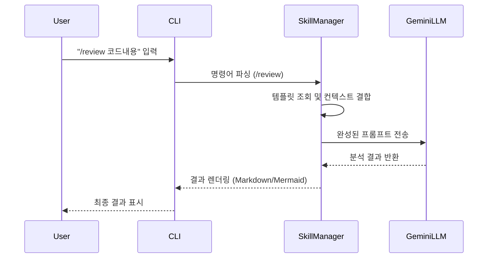

# SRS: Gemini Slash Command Skills System

## 1. 기능적 요구사항
- **F-01 (명령어 인식)**: 시스템은 입력창에 '/'로 시작하는 문자열을 감지해야 한다.
- **F-02 (스킬 실행)**: 정의된 슬래시 명령어 입력 시, 매핑된 템플릿 프롬프트를 실행해야 한다.
- **F-03 (컨텍스트 결합)**: 현재 열려있는 파일이나 대화 맥락을 프롬프트 변수로 활용할 수 있어야 한다.
- **F-04 (시각화 출력)**: 구조 분석 요청 시 Mermaid UML 형식의 다이어그램을 출력해야 한다.
- **F-05 (슬라이드 생성)**: 분석 데이터를 바탕으로 Hyperframes 규격의 HTML/CSS 슬라이드를 생성해야 한다.
- **F-06 (비디오 렌더링)**: 생성된 슬라이드를 CLI 명령어를 통해 MP4 비디오로 변환할 수 있어야 한다.
- **F-07 (PPTX 변환)**: PandasToPowerpoint를 사용하여 슬라이드 데이터를 네이티브 파워포인트 파일로 내보낼 수 있어야 한다.

## 2. 비기능적 요구사항
- **환경 의존성**: Node.js 22 이상 및 FFmpeg이 설치된 환경에서만 렌더링이 보장된다.
- **성능**: 명령어 매핑 및 프롬프트 치환은 1초 이내에 완료되어야 한다.
- **확장성**: `gemini.md` 파일 수정을 통해 새로운 스킬을 쉽게 추가할 수 있어야 한다.
- **일관성**: 동일한 명령어에 대해 일관된 품질의 응답 형식을 유지해야 한다.

## 3. 데이터 흐름도 (Mermaid)

